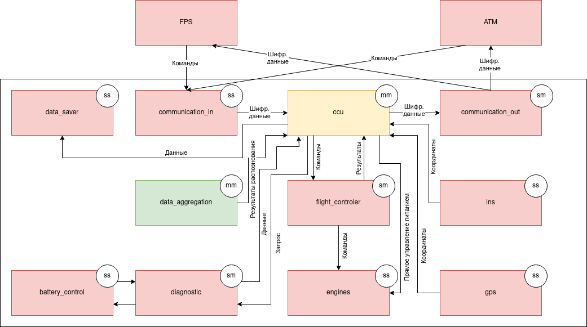
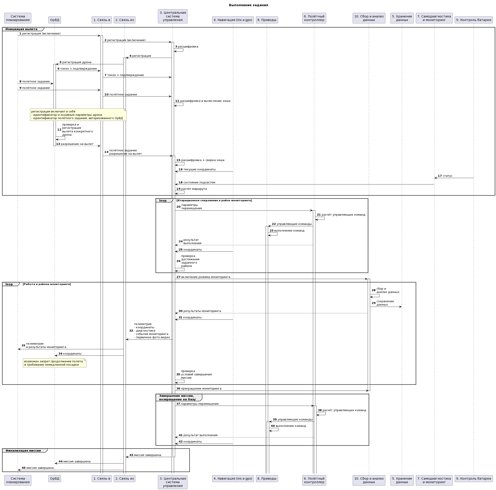
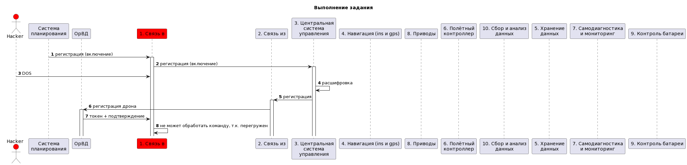
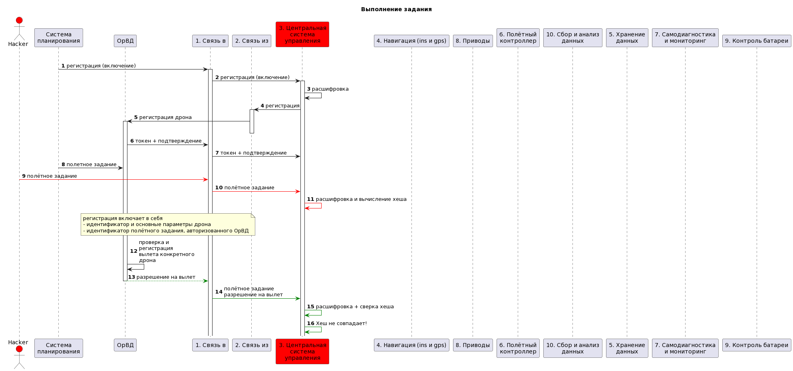

# Отчёт о выполнении задачи "Дрон-инспектор"

- [Отчёт о выполнении задачи "Дрон-инспектор"](#отчёт-о-выполнении-задачи-дрон-инспектор)
  - [Постановка задачи](#постановка-задачи)
  - [Известные ограничения и вводные условия](#известные-ограничения-и-вводные-условия)
    - [Цели и Предположения Безопасности (ЦПБ)](#цели-и-предположения-безопасности-цпб)
  - [Описание системы](#описание-системы)
    - [Компоненты](#компоненты)
    - [Алгоритм работы решения](#алгоритм-работы-решения)
    - [Описание Сценариев (последовательности выполнения операций), при которых ЦБ могут нарушаться](#описание-сценариев-последовательности-выполнения-операций-при-которых-цб-могут-нарушаться)
    - [Политики безопасности](#политики-безопасности)
  - [Запуск приложения и тестов](#запуск-приложения-и-тестов)
    - [Запуск приложения](#запуск-приложения)
    - [Запуск тестов](#запуск-тестов)
    - [Ожидаемый результат](#ожидаемый-результат)

## Постановка задачи

Компания создаёт дрон для мониторинга трубопроводов, тянущихся на сотни километров в том числе по горам, лесам и пустыням. Поэтому нужна функция автономного выполнения задачи. 
При этом даже в горах летает гражданская авиация (те же вертолёты экстренной медицинской помощи), очень бы не хотелось, чтобы, например, дрон компании врезался в вертолёт с пациентами. Поэтому тяжёлые автономные дроны должны летать в контролируемом воздушном пространстве, координацию полётов в котором осуществляет система организации воздушного движения (ОрВД).

В рамках хакатона участникам предлагается: 
- доработать предложенную архитектуру (см. далее) бортового обеспечения дронов-инспекторов с учётом целей безопасности
- декомпозировать систему и отделить критический для целей безопасности код
- в бортовом ПО нужно внедрить компонент "монитор безопасности" и реализовать контроль взаимодействия всех подсистем дрона
- доработать функциональный прототип 
- создать автоматизированные тесты, демонстрирующие работу механизмов защиты


## Известные ограничения и вводные условия
1. По условиям организаторов должна использоваться микросервисная архитектура и шина обмена сообщениями для реализации асинхронной работы сервисов.
2. Между собой сервисы ПЛК общаются через шину сообщений (message bus), а всё "снаружи" принимают в виде REST запросов.
3. Физическая надёжность аппаратуры (ПЛК и всего остального производства) и периметра не учитывается.
4. Графический интерфейс для взаимодействия с пользователем не требуется, достаточно примеров REST запросов.
5. Персонал, обслуживающий систему, благонадёжен.


### Цели и Предположения Безопасности (ЦПБ)
Цели безопасности:

1. Выполняются только аутентичные задания на мониторинг 
2. Выполняются только авторизованные системой ОрВД задания 
3. Все манёвры выполняются согласно ограничениям в полётном задании (высота, полётная зона/эшелон) 
4. Только авторизованные получатели имеют доступ к сохранённым данным фото-видео фиксации 
5. В случае критического отказа дрон снижается со скоростью не более 1 м/с 
6. Для запроса авторизации вылета к системе ОрВД используется только аутентичный идентификатор дрона 
7. Только авторизованные получатели имеют доступ к оперативной информации 

Добавлено:

8. Во время выполнения задания исполняются только авторизованные команды от ОрВД или СПП. 
9. ОрВД и СПП имеют независимые ключи доступа к дрону. 
10. Задержка в выполнении команд оператора составляет не более 1 секунды.
11. Компонентам дрона дополнительно затруднена возможность реверса устройства изнутри на программном уровне + Аутентификация компонентов. 
12. Полет осуществляется строго в заданной полетной области "по подписке". 
13. "Чувствительные" данные не выносятся из дрона. 


Предположения безопасности:

1. аутентичная система ОрВД благонадёжна
2. аутентичные сотрудники благонадёжны и обладают необходимой квалификацией
3. только авторизованные сотрудники управляют системами
4. аутентичное полётное задание составлено так, что на всём маршруте дрон может совершить аварийную посадку без причинения неприемлемого ущерба заказчику и третьим лицам


### Описание системы

Изначально, в общем виде контекст работы выглядел следующим образом:


В ходе решения она была детализирована до следующей:




### Компоненты

| Название | Назначение | Комментарий |
|----|----|----|
|*ATM (Air Traffic Manager, Система организации воздушного движения)* | Имитатор центральной (возможно, государственной) системы управления движением дронов в общем воздушном пространстве. Получает информацию о местоположении каждого дрона, подтверждает полетное задание. | - |
|*FPS (Flight Planning System, Система планирования полетов)* | Имитатор сервиса распределения задач по дронам. Позволяет согласовывать полетное задание с системой ATM, отправлять  дронов на задание, задавать режимы полёта. Получает данные телеметрии от дрона. | - |
|*drone_battery_control* | Имитатор контроллера заряда батареи. Сообщает ее состояние в ccu, при малом заряде сигнализирует об опасности. | Недоверенный |
|*drone_ccu* | Имитатор центрального блока управления. Осуществляет фактическую оркестрацию остальных модулей. | Доверенный + _Включает криптографический модуль и сличитель координат._ |
|*drone_communication_in* | Имитатор приемника входного радиосигнала, всего лишь передает данные внутрь. | Недоверенный, т.к. сквозное шифрование |
|*drone_communication_out* | Имитатор передатчика выходного сигнала, транслирует данные. | Недоверенный, т.к. сквозное шифрование |
|*drone_data_aggregation* | Имитатор камеры и соответсвующего ей анализатора входного видео-потока. | Доверенный + _Можно декомпозировать_ |
|*drone_data_saver* | Единственный компонент, имеющий доступ к внутренней памяти устройства. | Недоверенный |
|*drone_diagnostic* | Имитатор системы внутренней диагностики. | Недоверенный |
|*drone_engines* | Имитатор агрегатов. | Недоверенный |
|*drone_flight_controller* | Имитатор полетного контрллера. Получает на вход требуемое перемещение, рассчитывает параметры движения и управляет двигателями. | Недоверенный, т.к. не знает своих координат и имеются аварийные цепи |
|*drone_gps* | Имитатор системы GPS. | Недоверенный, т.к. дублируется |
|*drone_ins* | Имитатор системы ИНС. | Недовернный, т.е. дублируется |
|*monitor* | Авторизует операцию, если она удовлетворяет заданным правилам или блокирует её в противном случае. Выполняет иные функции обеспечения информационной безопасности, хранит лог работы системы. | - |

### Алгоритм работы решения


Диаграмма последовательности этого примера выглядит следующим образом:



[ссылка на исходник диаграммы](https://www.plantuml.com/plantuml/uml/vLRTRkDK4BxtKnpjxJP8_CCA8HwaDzxMb4XPEuhTIdlNj9HsbHKHAoGG4Zz8mBNhnCHDM_SLvhmHtuoFVNoyDb759HUfL7k-RsQ--HadusGIg2VqHY_eWKgwfNlAyIieLxIXbDRuuL-zVE9v_d4IXSSldWSpR-hFal71UEg72T2_ms2kpu2yetG_1DEjWPs2Csieb1-hmt4yzPE3hzuY-GN6R-XxCJgAJjotxxwZu2NJIzhers9o48MXQ_C-RFxYwFKPg5AwrQ_XDzNB_L3FtGZrEJs8JOP8SniTioQpQ1A_Z5tk3y3zizWNj0BdDmqYz3kXVWBJNq5UmBYajLw8MHpCJg9OkQOViIchhhz3RFUemGtKsr9fSi0RZa-V2WNBFnrFeiGbUK-akQPIdoegb8YDvE5_0pAf7rFh2o6PpgA388x7uP7ByY5O_cH9R0FqeECaclb7WGlzM098eIpI1J2b5K2bw5tGLZgYKF8Ql7XOYZhtj3BAJBuy7FkTU3u5wKzM22wcGf8fu2aUv5G8-BcV9C7ifUSTpQBZgQ8VnGMgKzT8eMaM8YA0dcq-DVfSMkYPeWTR0IexVK-vnrQmvfvy-lIP4kShQIT4rkycZ990HIVm0j1UrQg3EDh2-xVwab96uu7ISvXUuwKtKWXXNVKqpByMFQ51KsoeB55dqZqv9mDvf1Wv-z4BHMiH44snWyxLOKLbPmFiAHw0fdwRUhIjkHbXBmWF5MlW8NqZ7UjijW7wcTqYblsmNvNzi2sdgYQ2jcnieuEHpKmScPAEHbAbb3O2kB8B3PQjGZMLjKEF0k_g1ubvDxVbL9-Di2GWWAoVhJxNhmGXMK5AcHcW8S32guU1GQQt0OGu_1xGUOUujcSZCtAbNfgO99DrU_UrqKxYbM8mk-J4CQpSHleAltFspHNr9b4qnQJBnbmtnHT7cS3fXglHE-cKkgxjCeFaFLqhHoHdZUNPgtf9UmtE8Uc4trxlUedXWkBwebByJg9UEqHcEoEKNYZb3bJAnFOMYHIolWiwuF1jwNCqr3alkQhIIB_BX-Hxcgg_YuQht1r27g9cLVzTEy9Js_FDkDaIcuPmtTZB8YMrUyse8Md2Hy6A33I9wR7VA9M31YtStg9y26YzEx78O3J74NcrhgDgdxSEWJbqPgmkXW-ZYznTMRtOCH-FBsvOhHQPIpD0LH57lGJoVE1EZoHVkaPUPypH7wiOcldCyExIB4eSb98DHvIPErCsEzPUtg5egNYSNFOizmlbNc7boUVOHjYaqQkz_b0TbNemrZnnTX3Qno3rEC8pYV7QNN_tLIv08oipCZU2rNEPeoqLzYW-PZfvvOEq54Llgf3bjRvg3UkTRFWvJ8f_7KpZ8PTJcjPRTNYe3WF_81cV-D3HajIVMZzqGn4U6yaU0giapxhUK27vcEDQF-ukgF_rML3_vIf8PvZQ_K65tOFsMxHLFTMcjHzMraO0tNRiZkLku-vos8MHBBmlyFVunUGV)


### Описание Сценариев (последовательности выполнения операций), при которых ЦБ могут нарушаться

В данный момент архитектура представлена исходя из задачи выполнения поставленных ЦБ при условии произвольного отказа ОДНОГО недоверенного компонента.
В случае одновременного сбоя двух и более компонентов поставленные ЦБ почти гарантированно будут нарушены. Такое решение обусловлено задачей минимазации доверенного кода и приемлемости среднего ущерба (см. ценности, ущербы и неприемлимые события в постановке задачи).
 
Автор считает, что невыполнение дроном бизнес-функции не является нарушением ЦБ (кроме одной, им и внесенной, и не выполненной), а вероятность произвольного отказа и падения дрона (произвольный отказ модуля питания) на элемент критической инфраструктуры (неприемлимое событие) является величиной статистически незначительной, в остальных же случаях блок управления сможет измежать столкновения/смягчить его последствия.

В соответсвии с представленной выше информацией, автором были определены наиболее вероятные сценарии атаки на систему:

 Название | Атакованный модуль | Нарушенная ЦБ | Комментарий |
|----|----|----| ----|
|*1. DOS атака на communication_in* | communication_in | 1,2,4,7,8,10 | Отказ в обслуживании, но не нарушение ЦБ, все-таки |
|*2. Подмена/Фальшивые входные данные* | communication_in/ccu | 1,2,3,4,8,10 | Компенсируется шифрованием и паролями |
|*3. Атака через Third-party software* | any | any | Идея кибериммунитета в том, чтобы это не сломало все |
|*4. Взлом communication_in, как открытой точки доступа* | communication_in | 1,2,3,8,10 | Если это радиомодуль, который просто передает данные внутрь, то это маловероятно |
|*5. Потеря "чувствительных" данных через выходные порты* | communication_out | 4,6,7,13 | Компенсируется валидацией |
|*6. Произвольное бездействие компонента* | any | any | Дублирование? :) |
|*7. Компонент притворяется другим*| any | 1,2,3,6,8,10,11 | Уникальные имена + авторизация |
|*8. Внутренний DOS от взломанного компонента* | any | any | Можно навесить проверки в монитор |
|*9. Подмена выходных данных к ОрВД, СПП* | communication_out | 4,7,13 | Шифрование и подписи |
|*10. Внутренний code injection* | any | 1,2,3,4,8,10,11,13 | Монитор и валидация сообщений |
|*11. Брутфорс подписей* | communication_in/ccu | 1,2,3,6,7,8 | Изнутри не хватит мощности, снаружи - можно обработать в ccu |
|*12. Отсутсвие выходных данных* | ccu/communication_out | 4,6,7,13 | Дрон летает, но никто не знает, где. Плохо, но ЦБ не то, чтобы нарушаются. |
|*13. Некорректные входные данные* | ccu | 1,2,3,8,12 | Ошибки операторов могут привести к оказу в выполнении задания/блокировке дрона через atm |
|*14. Повторные и противоречивые команды от операторов* | ccu | 1,2,3,8,10 | Приоритеты команд + последовательности и ограничения |
|*15. Отказ/взлом (одного) модуля навигации* | gps/ins | 1,2,3,5,10,12 | Есть второй, сличение через ccu по близости к предыдущим |
|*16. Неверные/некорректные внутренние данные* | any | 1,2,3,4,5,7,8,10,12,13 | Валидация и обработка ошибок |
|*17. Попытка украсть данные при получении/передаче* | communication_in/out | 4,6,7,13 | Их расшифровка займет много времени - ключи надо менять не реже этого |
|*18. Атака на внутрисистемное время* | ccu | 1,2,3,10,12 | Синхронизировать его по другому |
|*19. Потеря лога/видеозаписи* | data_aggregation/ccu/data_saver | 1,2,4 | Это опять же не то, чтобы нарушает ЦБ |

**Негативный сценарий 1 - DOS атака на communication_in:**



[ссылка на исходник диаграммы](https://www.plantuml.com/plantuml/uml/vLRTRkDK4BxtKnpjxJP8_CCA8HwaDzxMb4XPEuhTIdlNj9HsbHKHAoGG4Zz8mBNhnCHDM_SLvhmHtuoFVNoyDb759HUfL7k-RsQ--HadusGIg2VqHY_eWKgwfNlAyIieLxIXbDRuuL-zVE9v_d4IXSSldWSpR-hFal71UEg72T2_ms2kpu2yetG_1DEjWPs2Csieb1-hmt4yzPE3hzuY-GN6R-XxCJgAJjotxxwZu2NJIzhers9o48MXQ_C-RFxYwFKPg5AwrQ_XDzNB_L3FtGZrEJs8JOP8SniTioQpQ1A_Z5tk3y3zizWNj0BdDmqYz3kXVWBJNq5UmBYajLw8MHpCJg9OkQOViIchhhz3RFUemGtKsr9fSi0RZa-V2WNBFnrFeiGbUK-akQPIdoegb8YDvE5_0pAf7rFh2o6PpgA388x7uP7ByY5O_cH9R0FqeECaclb7WGlzM098eIpI1J2b5K2bw5tGLZgYKF8Ql7XOYZhtj3BAJBuy7FkTU3u5wKzM22wcGf8fu2aUv5G8-BcV9C7ifUSTpQBZgQ8VnGMgKzT8eMaM8YA0dcq-DVfSMkYPeWTR0IexVK-vnrQmvfvy-lIP4kShQIT4rkycZ990HIVm0j1UrQg3EDh2-xVwab96uu7ISvXUuwKtKWXXNVKqpByMFQ51KsoeB55dqZqv9mDvf1Wv-z4BHMiH44snWyxLOKLbPmFiAHw0fdwRUhIjkHbXBmWF5MlW8NqZ7UjijW7wcTqYblsmNvNzi2sdgYQ2jcnieuEHpKmScPAEHbAbb3O2kB8B3PQjGZMLjKEF0k_g1ubvDxVbL9-Di2GWWAoVhJxNhmGXMK5AcHcW8S32guU1GQQt0OGu_1xGUOUujcSZCtAbNfgO99DrU_UrqKxYbM8mk-J4CQpSHleAltFspHNr9b4qnQJBnbmtnHT7cS3fXglHE-cKkgxjCeFaFLqhHoHdZUNPgtf9UmtE8Uc4trxlUedXWkBwebByJg9UEqHcEoEKNYZb3bJAnFOMYHIolWiwuF1jwNCqr3alkQhIIB_BX-Hxcgg_YuQht1r27g9cLVzTEy9Js_FDkDaIcuPmtTZB8YMrUyse8Md2Hy6A33I9wR7VA9M31YtStg9y26YzEx78O3J74NcrhgDgdxSEWJbqPgmkXW-ZYznTMRtOCH-FBsvOhHQPIpD0LH57lGJoVE1EZoHVkaPUPypH7wiOcldCyExIB4eSb98DHvIPErCsEzPUtg5egNYSNFOizmlbNc7boUVOHjYaqQkz_b0TbNemrZnnTX3Qno3rEC8pYV7QNN_tLIv08oipCZU2rNEPeoqLzYW-PZfvvOEq54Llgf3bjRvg3UkTRFWvJ8f_7KpZ8PTJcjPRTNYe3WF_81cV-D3HajIVMZzqGn4U6yaU0giapxhUK27vcEDQF-ukgF_rML3_vIf8PvZQ_K65tOFsMxHLFTMcjHzMraO0tNRiZkLku-vos8MHBBmlyFVunUGV)

**Негативный сценарий 2 - Подмена/Фальшивые входные данные:**



[ссылка на исходник диаграммы](https://www.plantuml.com/plantuml/uml/vLP9RzjM4BxpLpoabmQsYkvBK1GvzaSOA1YPTOJAf21I1dBp4jSE5DHeKA15WIu5sfufMepenSfVcFUF-isGJu-F8QCAFVQW87wS-MRvPfc7SUAFayd-q4i6oJ1Gz-Y5dj8hMj8DtL6ENq6veWMbDCSFV-gBUvxdJv8edEm_2iQUtq-YiVhIxtyJZ9KVgyVb_zuQ1xlU2DY3_c3aXmcG_u3oaJu6wYsbEo6it5IGXx2NhU0PPNSGZ_oa_nW6N91V8Vo2VX2XlUZ0_VhUEmfMCdr12_rSKIPI_MZ_gq7e2hxl2XQqM8b6ayIL_G2oVtCgz35iftIZdyFHL5_iXFh83KcVq2kHoH1QRiC1S9YCes7y96v9p8Smy8ie5NG9u6zPJRqz26DuflP6yNt12Fr6j9z2xpUOAw2vfBcUYbWSZ0-YMBcY7xCeawg_XxTteFWA15pZHQ8Ikk6nFXG8PdSq64P98xllIjPcjDI7x9aGXdnm-e0czS7O-bHGHkEe7yJn8DnpOJu2ob-S9LjWBTengihV2rpLJyI1b6uvNYYcT0cbfL1GqBLKLQ7aCt3nk9JqtD5bbPhXrxi3l-7FPm3zkPu9heWPfL1FyP1J8SgF_2G9nayyRsySJKQAVX8Ju6h56EffAbc4ecSBMFM-g6fmQ-k14iHBAHkOiso3mskO_awVcQJSzqejrhVrioc6rNHn12K5mZbqdrOTY0ow2gOZkgrwbGI4kH_Vu1xDnSeTR43GPWKA80gsuRFQKZ9yvdZAk1xf9SrDCAtv-FVQvM2g_7mWaXLRA25to5bnwwPeI0UrQNIxjrwhdI0P55qiIVkXtC0qqco63S3rAUKGJhqmIW8L7I02HBjjXc0NDRPmKiu87XHWSvhXezU3jJAFY05kbArMTfSuWWQKs3APB3c7ZCwHFitPZfxMo5y3vsRhafQDvREjU5AkMdjXDeSLhpQ45uIxYhCWrMPP5p-aEgf4xeJjMTa9wmsjocb9ronilODGewnN1TFhbUpHGbJELnonhBBO7Ms-jdB4x_Necmu0jGNgRO9iHTM0Fk_nDfBMov6H4_sCJKkAX9Uv35rmggUU6RfGCZCKYiWqVuVgKGFOoBCGLvPGVM62a_QkhztryPrn1XKlQ5JYENudR9lBmnj64KzoHZAy2vLbkgl6cgzAJ3p8IbAlMB1rrJHdg5sd8BMbD-GIOlkvl3qpXuEtqdD06d7LJmvzWHO65VgqfE9Ml9wxGELz05TQLIbtL9a_aRUQ225hEn4x3BxEIOwIFU4jMvO0mdVn9FYMQcilhsxwcwtEhRgw5LwA8UbosrMsgIt5LQMuPknf8vI-jdObJDWeE2DTHL8Mt--KoaM5NBYrHNcNehNk-Y8TOwupn5KxprJzld81pALLzTjfzsNcQgvdLa_NzCV6vCgbKOqTjARfePB7NYk6l7VSYZq9cMO8xPWnsjqLmQf5CtmxC-FXgT2sxF6hBBHb_HYo1s2NmrHibZJdq6hFcBlsbKSPP1O2A1KlAqGQ0twO3fbpwzcEgE-Tr6CdZyNDcJi7xyfme8t0gjwv4brz90rrJONTmPkqAIy5WF9R0KXnMJxhyrhNtieEE898ySOEhIpaihbJCrwxksityFl9uC177Ys8EVf_RBeYEDQJRJXMfZnhMfErF8C-wDviGQZ_zNvG_saze38CTtzIOGUYEV8SzbJxmC4XPyL4frcHpURSIDuEYhLg4iv3_3FP7_u3)

**Еще много отдельных диаграмм**

### Политики безопасности 


```python {lineNo:true}

  if src == 'drone_battery_control' and dst == 'drone_diagnostic' \
        and operation == 'battery_status':
        authorized = True
    if src == 'drone_ccu' and dst == 'drone_flight_controller' \
        and operation == 'stop':
        authorized = True
    if src == 'drone_ccu' and dst == 'drone_flight_controller' \
        and operation == 'clear':
        authorized = True
    if src == 'drone_ccu' and dst == 'drone_communication_out' \
        and operation == 'watchdog':
        authorized = True
    if src == 'drone_ccu' and dst == 'drone_data_aggregation' \
        and operation == 'camera_on':
        authorized = True
    if src == 'drone_ccu' and dst == 'drone_data_aggregation' \
        and operation == 'camera_off':
        authorized = True
    if src == 'drone_ccu' and dst == 'drone_communication_out' \
        and operation == 'log':
        authorized = True
    if src == 'drone_ccu' and dst == 'drone_flight_controller' \
        and operation == 'move_to':
        authorized = True
    if src == 'drone_ccu' and dst == 'drone_diagnostic' \
        and operation == 'get_status':
        authorized = True
    if src == 'drone_ccu' and dst == 'drone_communication_out' \
        and operation == 'register':
        authorized = True
    if src == 'drone_ccu' and dst == 'drone_communication_out' \
        and operation == 'sign_out':
        authorized = True
    if src == 'drone_ccu' and dst == 'drone_communication_out' \
        and operation == 'send_position':
        authorized = True
    if src == 'drone_ccu' and dst == 'drone_communication_out' \
        and operation == 'data':
        authorized = True
    if src == 'drone_communication_in' and dst == 'drone_ccu' \
        and operation == 'in':
        authorized = True
    if src == 'drone_data_aggregation' and dst == 'drone_ccu' \
        and operation == 'data':
        authorized = True
    if src == 'drone_data_aggregation' and dst == 'drone_data_saver' \
        and operation == 'smth':
        authorized = True
    if src == 'drone_diagnostic' and dst == 'drone_ccu' \
        and operation == 'diagnostic_status':
        authorized = True
    if src == 'drone_diagnostic' and dst == 'drone_battery_control' \
        and operation == 'get_battery':
        authorized = True
    if src == 'drone_flight_controller' and dst == 'drone_gps' \
        and operation == 'get_coordinate':
        authorized = True
    if src == 'drone_flight_controller' and dst == 'drone_ins' \
        and operation == 'get_coordinate':
        authorized = True
    if src == 'drone_flight_controller' and dst == 'drone_ccu' \
        and operation == 'reached':
        authorized = True
    if src == 'drone_flight_controller' and dst == 'drone_battery_control' \
        and operation == 'change_battery':
        authorized = True
    if src == 'drone_flight_controller' and dst == 'drone_engines' \
        and operation == 'smth':
        authorized = True
    if src == 'drone_gps' and dst == 'drone_ccu' \
        and operation == 'gps_coordinate':
        authorized = True
    if src == 'drone_ins' and dst == 'drone_ccu' \
        and operation == 'ins_coordinate':
        authorized = True  

```

## Запуск приложения и тестов

### Запуск приложения

см. [инструкцию по запуску](README.md)

### Запуск тестов

_Предполагается, что в ходе подготовки рабочего места все системные пакеты были установлены, среда разработки настроена в соответсвии с руководством, на которое приведена ссылка выше._

Запуск примера: открыть окно терминала в Visual Studio code, в папке с исходным кодом выполнить 

**make run**
или **docker-compose up -d**

запуск тестов:
**make test**
или **pipenv run pytest**

### Ожидаемый результат


